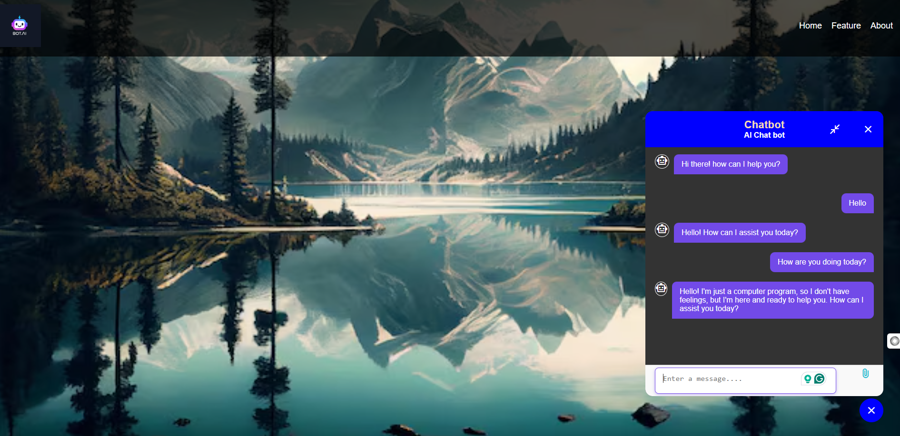

# rag_chatbot

### Steps to test the app
1. install requirements file `pip install -r requirements.txt`

2. cd to `app` directory and run the server `uvicorn server:app --reload` via terminal

3. open the `index.html` file and chat with the app.

### Chatbot UI

